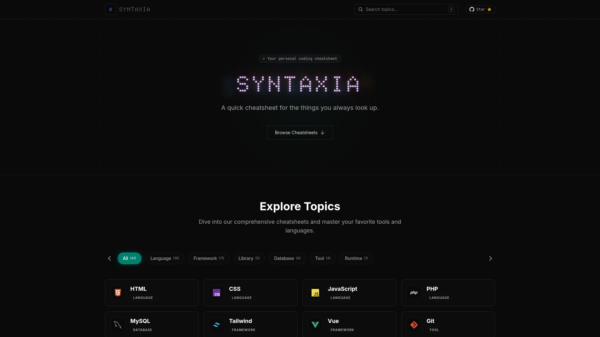

# Syntaxia

**Your personal coding reference for the things you always look up.**



A sleek, centralized cheatsheet for programming languages, libraries, and frameworks built with **Vue 3**, **Tailwind CSS**, and **Shiki**.

## Quick Start

```sh
npm install
npm run dev
```

## Adding Topics

1. Add the topic content to the `refTopics` object in `src/data/refContent.ts`.
2. Add the language metadata to the `languages` array in `src/views/HomeView.vue`.
3. Add the corresponding icon to the `public/` directory.

---

[MIT License](LICENSE) &copy; 2026 Ebad Yasser
